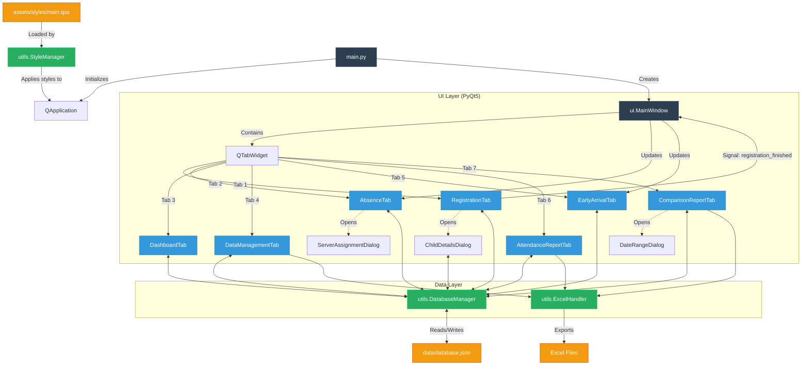

# Project Architecture & Flow

This diagram illustrates the high-level architecture and data flow of the 5edma Management System.

## Flow Description

1.  **Initialization**: `main.py` starts the application and uses `StyleManager` to load `assets/styles/main.qss`.
2.  **Main Interface**: `MainWindow` serves as the shell, hosting multiple functional tabs.
3.  **Registration**: The `RegistrationTab` handles daily attendance. When registration is finished, it emits a signal to update other tabs like `AbsenceTab` and `EarlyArrivalTab`.
4.  **Dashboard**: `DashboardTab` provides visual analytics and time-series trends using Matplotlib.
5.  **Data Management**: All tabs interact with `DatabaseManager` to read/write from `data/database.json`.
6.  **Reporting**: `AttendanceReportTab` and `ComparisonReportTab` aggregate data and use `ExcelHandler` (or internal logic) to export reports.
